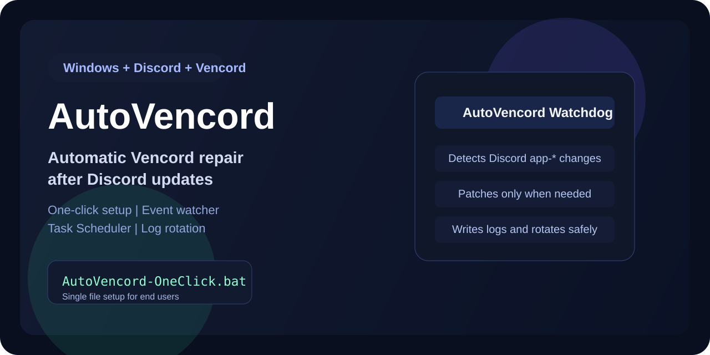
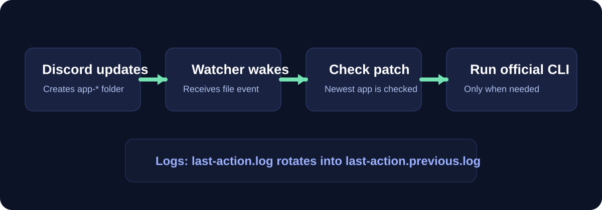

# AutoVencord



One-click Windows setup that automatically re-patches Vencord after Discord updates using Task Scheduler and a low-overhead `FileSystemWatcher`.

## EN

### What it does

`install.ps1` installs a small local helper into `%LOCALAPPDATA%\AutoVencord`, downloads the official `VencordInstallerCli.exe`, patches Discord once, and creates a single background Task Scheduler job named `AutoVencord Watchdog`.

The watchdog:

- watches `%LOCALAPPDATA%\Discord`
- detects newly created or updated `app-*` Discord versions
- waits while Discord or Squirrel updater is still active
- checks that `app.asar` exists, is readable, non-empty, and stable before patching
- verifies whether the newest Discord version is already patched
- runs the official Vencord CLI only when patching is really needed
- writes actions and errors to `last-action.log`
- rotates the log automatically when it exceeds 2 MB

### Interface

The PowerShell bootstrap uses a simple built-in console menu:

- arrow-key navigation
- current install and watchdog status
- automatic Russian or English selection from the system language

### Why this approach

- no custom patched binaries are shipped in the repository
- the patch is always applied through the official Vencord CLI
- no busy polling loop is used; the watcher is event-based with a rare safety check
- no duplicate scheduled tasks are created; the installer always updates the same task

### Compatibility

The scripts are written to be friendly to older Windows setups by:

- using plain batch and Windows PowerShell
- falling back to `schtasks.exe` when newer Task Scheduler PowerShell cmdlets are unavailable
- using the classic PowerShell menu directly without extra UI runtimes

This project is intended for Windows versions that can still run the target Discord and Vencord combination on the machine. Script compatibility is broader than product support, so actual runtime support still depends on the Discord and Vencord versions available for that OS.

### Install

PowerShell one-command install:

```powershell
irm https://raw.githubusercontent.com/Kevanko/AutoVencord/main/install.ps1 | iex
```

The PowerShell bootstrap auto-detects the system UI language and opens:

- `Install`
- `Update`
- `Uninstall`
- `Open Folder`

Manual BAT install:

1. Download [`AutoVencord-OneClick.bat`](./AutoVencord-OneClick.bat).
2. Run it.
3. Wait until the setup finishes.

Installed files:

- `%LOCALAPPDATA%\AutoVencord\AutoVencord-Setup.ps1`
- `%LOCALAPPDATA%\AutoVencord\watchdog.ps1`
- `%LOCALAPPDATA%\AutoVencord\uninstall.bat`
- `%LOCALAPPDATA%\AutoVencord\last-action.log`

Scheduled task:

- `AutoVencord Watchdog`

### Verify

PowerShell:

```powershell
Get-ScheduledTask | Where-Object { $_.TaskName -like '*AutoVencord*' } | Select-Object TaskName, State
Get-ScheduledTaskInfo -TaskName "AutoVencord Watchdog"
```

Open installed folder:

```powershell
explorer "$env:LOCALAPPDATA\AutoVencord"
```

### Uninstall

Run:

```bat
%LOCALAPPDATA%\AutoVencord\uninstall.bat
```

### Flow



## RU


### Что делает

`AutoVencord-OneClick.bat` ставит маленький локальный helper в `%LOCALAPPDATA%\AutoVencord`, скачивает официальный `VencordInstallerCli.exe`, один раз патчит Discord и создает одну фоновую задачу Планировщика под названием `AutoVencord Watchdog`.

Watcher:

- следит за `%LOCALAPPDATA%\Discord`
- замечает новые или обновленные папки `app-*`
- ждет, пока Discord или Squirrel updater закончит работу
- проверяет, что `app.asar` существует, читается, не пустой и уже стабилен перед патчем
- проверяет, пропатчена ли самая свежая версия Discord
- запускает официальный Vencord CLI только когда патч реально нужен
- пишет действия и ошибки в `last-action.log`
- автоматически ротирует лог после 2 MB

### Интерфейс

PowerShell bootstrap использует простое встроенное консольное меню:

- навигация стрелками
- текущий статус установки и watchdog
- автоматический выбор русского или английского языка по системе

### Почему так

- в репозитории нет кастомных пропатченных бинарников
- патч всегда применяется через официальный Vencord CLI
- нет тяжелого polling-цикла; watcher работает по событиям и редко делает страховочную проверку
- дубликаты задач не создаются; установщик всегда обновляет одну и ту же задачу

### Совместимость

Скрипты написаны так, чтобы быть дружелюбными к старым Windows-конфигурациям:

- обычный batch и Windows PowerShell
- fallback на `schtasks.exe`, если нет новых PowerShell cmdlet для Планировщика
- меню работает без дополнительных UI runtime-зависимостей

Проект рассчитан на те версии Windows, где в принципе работает нужная связка Discord и Vencord. Совместимость скриптов шире, чем официальная поддержка самих продуктов, поэтому фактическая работа все равно зависит от доступных версий Discord и Vencord для конкретной ОС.

### Установка

Установка одной командой PowerShell:

```powershell
irm https://raw.githubusercontent.com/Kevanko/AutoVencord/main/install.ps1 | iex
```

PowerShell bootstrap автоматически определяет язык системы и открывает меню:

- `Install`
- `Update`
- `Uninstall`
- `Open Folder`

Ручная установка через BAT:

1. Скачай [`AutoVencord-OneClick.bat`](./AutoVencord-OneClick.bat).
2. Запусти его.
3. Дождись завершения настройки.

После установки появятся:

- `%LOCALAPPDATA%\AutoVencord\watchdog.ps1`
- `%LOCALAPPDATA%\AutoVencord\uninstall.bat`
- `%LOCALAPPDATA%\AutoVencord\last-action.log`

Задача Планировщика:

- `AutoVencord Watchdog`

### Проверка

PowerShell:

```powershell
Get-ScheduledTask | Where-Object { $_.TaskName -like '*AutoVencord*' } | Select-Object TaskName, State
Get-ScheduledTaskInfo -TaskName "AutoVencord Watchdog"
```

Открыть установленную папку:

```powershell
explorer "$env:LOCALAPPDATA\AutoVencord"
```

### Удаление

Запусти:

```bat
%LOCALAPPDATA%\AutoVencord\uninstall.bat
```

### Flow


