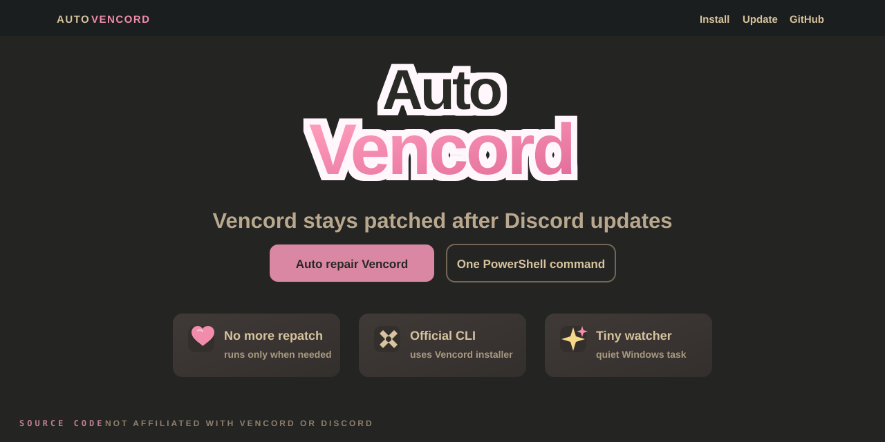

# AutoVencord



AutoVencord is a small Windows automation for Vencord. It keeps Vencord working after Discord updates by using the official Vencord CLI only when a new Discord `app-*` version needs repair.

## Quick Start

Run in PowerShell:

```powershell
irm https://get.vencord.ru | iex
```

Or download and run `AutoVencord-OneClick.bat`. It opens the same menu as the PowerShell command.

The menu opens automatically in Russian or English:

- `Install`
- `Update`
- `Open Folder`
- `Uninstall`
- `Exit`

## What It Does

- checks that Discord is installed before setup
- watches the detected Discord install folder for new `app-*` versions
- waits while Discord is still updating
- runs the official `VencordInstallerCli.exe` only when the newest Discord version is not patched
- writes logs to `%LOCALAPPDATA%\AutoVencord\last-action.log`
- keeps one Task Scheduler job: `AutoVencord Watchdog`

## If Discord Is Missing

AutoVencord will not install if Discord is not found or looks incomplete.

If AutoVencord is already installed and Discord was removed, the menu switches to a safe mode with only:

- `Uninstall`
- `Exit`

Install or start Discord once, then run AutoVencord again. If Discord is installed outside `%LOCALAPPDATA%\Discord`, AutoVencord tries to find it from the running Discord process and Discord shortcuts.

Manual path override:

```powershell
$env:AUTOVENCORD_DISCORD_ROOT = "D:\Path\To\Discord"
irm https://get.vencord.ru | iex
```

## Files

Installed folder:

```text
%LOCALAPPDATA%\AutoVencord
```

Main files:

- `AutoVencord.Core.ps1`
- `AutoVencord-Setup.ps1`
- `watchdog.ps1`
- `installed-manifest.json`
- `uninstall.bat`
- `last-action.log`

## Check Status

```powershell
Get-ScheduledTask -TaskName "AutoVencord Watchdog"
explorer "$env:LOCALAPPDATA\AutoVencord"
```

## Uninstall

Use `Uninstall` in the menu. It opens a small choice screen:

- `AutoVencord only`
- `AutoVencord + remove Vencord`
- `Back`

The second option uses the official Vencord CLI and is available only when Discord is installed and ready.

You can also remove only AutoVencord with:

```bat
%LOCALAPPDATA%\AutoVencord\uninstall.bat
```

## RU

AutoVencord — маленькая автоматизация для Vencord на Windows. Она помогает Vencord не слетать после обновлений Discord: следит за новыми версиями Discord `app-*` и запускает официальный Vencord CLI только когда нужен ремонт патча.

## Быстрый Старт

Запусти в PowerShell:

```powershell
irm https://get.vencord.ru | iex
```

Или скачай и запусти `AutoVencord-OneClick.bat`. Он открывает то же меню, что и команда PowerShell.

Меню само выберет русский или английский язык:

- `Установить`
- `Обновить`
- `Открыть папку`
- `Удалить`
- `Выход`

## Что Делает

- проверяет, что Discord установлен перед установкой AutoVencord
- следит за найденной папкой Discord и новыми папками `app-*`
- ждёт, пока Discord закончит обновляться
- запускает официальный `VencordInstallerCli.exe` только если свежая версия Discord не пропатчена
- пишет лог в `%LOCALAPPDATA%\AutoVencord\last-action.log`
- держит одну задачу Планировщика: `AutoVencord Watchdog`

## Если Discord Не Найден

AutoVencord не даст установить себя, если Discord не найден или установлен неполно.

Если AutoVencord уже был установлен, а Discord удалили, меню перейдёт в безопасный режим. Там останется только:

- `Удалить`
- `Выход`

Установи или запусти Discord один раз, потом открой AutoVencord снова. Если Discord установлен не в `%LOCALAPPDATA%\Discord`, AutoVencord попробует найти его по запущенному процессу Discord и ярлыкам Discord.

Ручное указание пути:

```powershell
$env:AUTOVENCORD_DISCORD_ROOT = "D:\Path\To\Discord"
irm https://get.vencord.ru | iex
```

## Файлы

Папка установки:

```text
%LOCALAPPDATA%\AutoVencord
```

Основные файлы:

- `AutoVencord.Core.ps1`
- `AutoVencord-Setup.ps1`
- `watchdog.ps1`
- `installed-manifest.json`
- `uninstall.bat`
- `last-action.log`

## Проверка

```powershell
Get-ScheduledTask -TaskName "AutoVencord Watchdog"
explorer "$env:LOCALAPPDATA\AutoVencord"
```

## Удаление

Нажми `Удалить` в меню. Откроется выбор:

- `Только AutoVencord`
- `AutoVencord + снять Vencord`
- `Назад`

Второй вариант использует официальный Vencord CLI и доступен только когда Discord установлен и готов.

Удалить только AutoVencord можно и командой:

```bat
%LOCALAPPDATA%\AutoVencord\uninstall.bat
```
